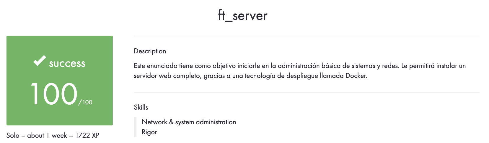

42Madrid Cursus - ft_server

## Objetivo

Crear un servidor web completo, capaz de hacer funcionar varios servicios como Wordpress, phpmyadmin y una base de datos.

## Uso

`make build` - Crea la imagen 'mrubio:LEMP'. 
`make run` - Crea e inicia el contenedor. 
#(Siempre en localhost)
